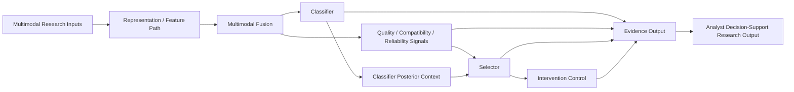

# F1 鈥?AEGIS Research Core v1.0 Canonical Architecture

**Caption.** Canonical functional architecture of the frozen AEGIS Research Core v1.0. Classifier, reliability signals, selector, intervention control, and evidence output are distinct functions.

**Evidence basis.** P1 canonical architecture, component ledger, and dataflow/evidence model.

**Interpretation boundary.** This is a research architecture, not evidence of production readiness, autonomous attribution, or autonomous threat determination.
