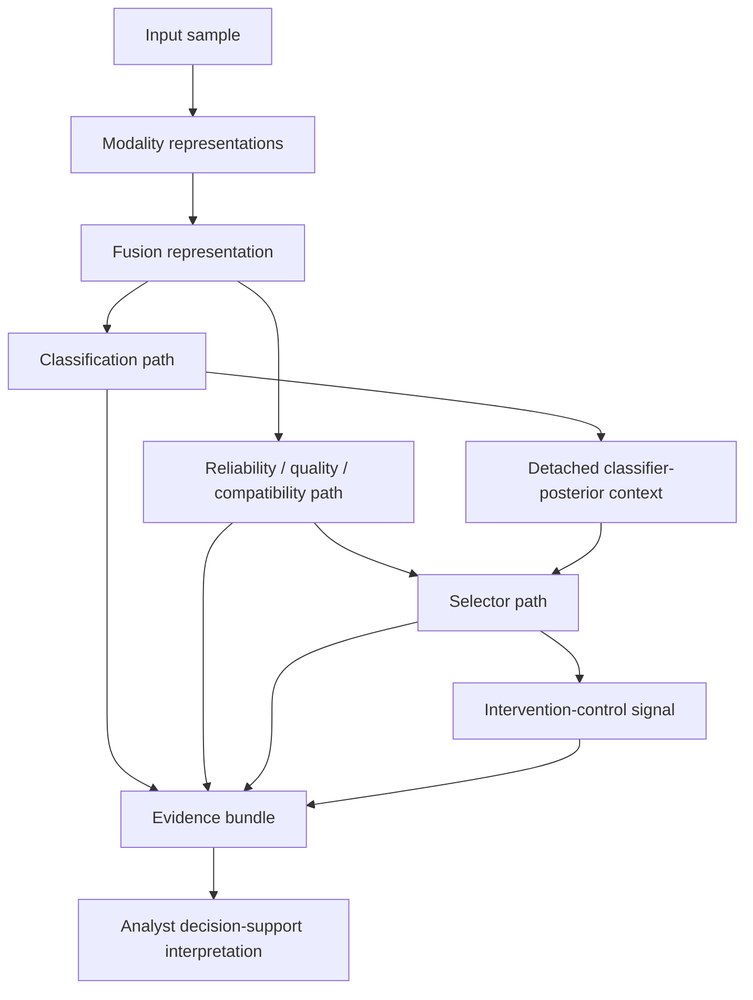

# F2 鈥?Multimodal Dataflow and Evidence Model

**Caption.** Frozen research dataflow separating classification evidence from reliability, selector, and intervention-control evidence.

**Evidence basis.** P1 dataflow and evidence model plus the frozen v0.35 two-stage posterior-context correction.

**Interpretation boundary.** Evidence aggregation supports analyst interpretation; it does not establish autonomous attribution.
