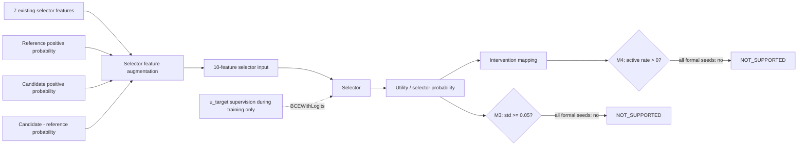

# F3 鈥?Reliability, Selector, and Intervention Control Path

**Caption.** v0.35 classifier-posterior-context correction and its prospective activation criteria. Ground-truth class and true-class delta-u were prohibited as selector inference inputs.

**Evidence basis.** Frozen v0.35 design, implementation, protocol, training evidence, and closure.

**Interpretation boundary.** Optimization signal existed, but selector output discrimination and active intervention criteria were not satisfied.
