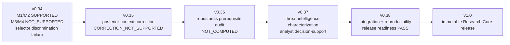

# F4 鈥?Scientific Progression v0.34 to v1.0

**Caption.** Governed scientific progression from selector-failure localization through corrective testing, blocked robustness evaluation, bounded characterization, release-readiness verification, and immutable v1.0 freeze.

**Evidence basis.** P2 experiment timeline and frozen experiment/release records.

**Interpretation boundary.** The progression records both positive and negative findings; it is not a retrospective success-only narrative.
