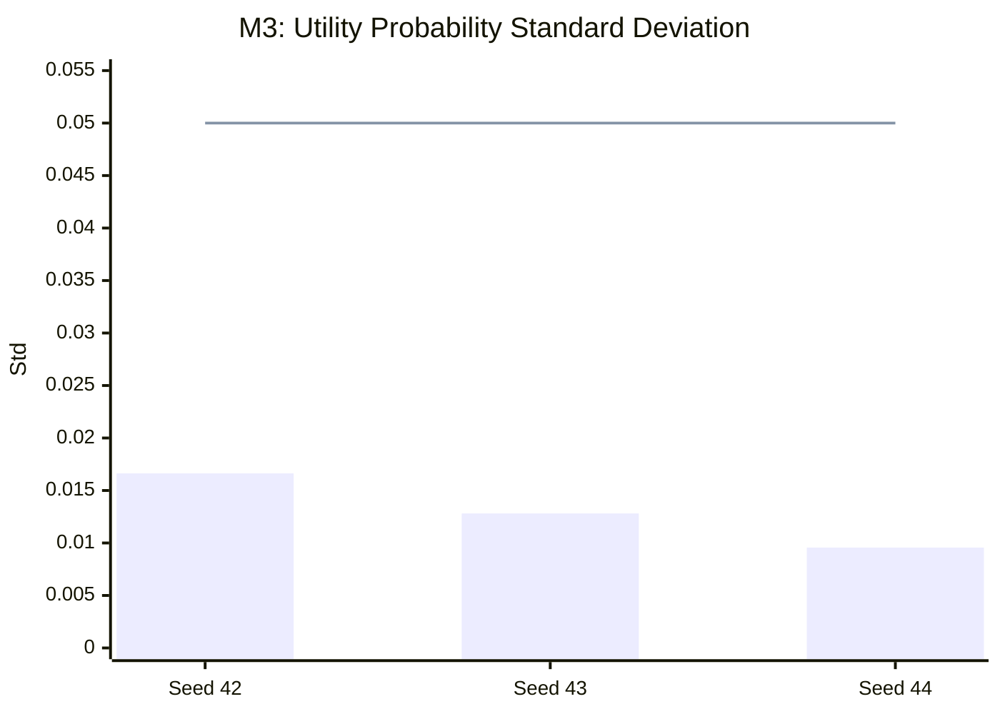

# F5 鈥?v0.35 Selector Discrimination and Intervention Results

## Frozen seed-level values

| Seed | Validation Macro-F1 | Utility probability std | M3 threshold | M3 | Active intervention rate | M4 criterion | M4 |
|---:|---:|---:|---:|---|---:|---|---|
| 42 | 0.8669 | 0.016633 | >= 0.05 | NOT_SUPPORTED | 0 | > 0 | NOT_SUPPORTED |
| 43 | 0.8716 | 0.012812 | >= 0.05 | NOT_SUPPORTED | 0 | > 0 | NOT_SUPPORTED |
| 44 | 0.8610 | 0.009565 | >= 0.05 | NOT_SUPPORTED | 0 | > 0 | NOT_SUPPORTED |

**Caption.** All three formal seeds remain below the frozen M3 threshold `utility_probability_std >= 0.05`; active intervention rate is 0 for all three seeds against M4 criterion `> 0`. Validation Macro-F1 values provide classifier-validation context but are not formal robustness measurements.

**Frozen conclusion.** `V035_C1_CLASSIFIER_POSTERIOR_CONTEXT` 鈫?`CORRECTION_NOT_SUPPORTED`. M3 `NOT_SUPPORTED`; M4 `NOT_SUPPORTED`.

**Critical boundary.** v0.36 active-intervention robustness is `NOT_COMPUTED`, not zero. Selector failure does not establish classifier non-robustness.
