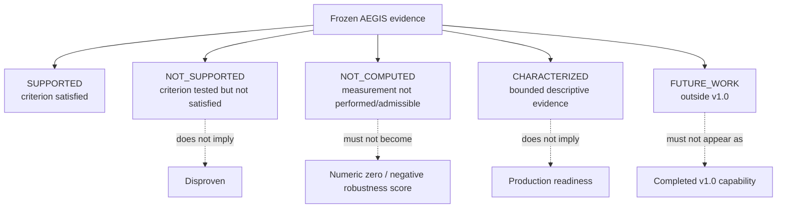

# F6 鈥?Evidence and Claim Boundary Map

**Caption.** Claim semantics governing AEGIS post-v1 communication.

**Evidence basis.** P2 claims matrix, scientific results ledger, and limitations/negative findings.

**Interpretation boundary.** No figure may infer classifier non-robustness from selector failure, or production/autonomous capability from research characterization.
