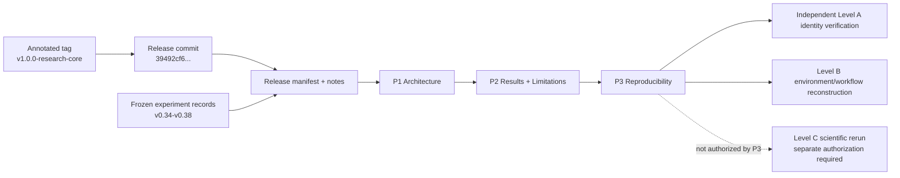

# F7 鈥?Reproducibility and Provenance Chain

**Caption.** Provenance hierarchy from immutable release identity and frozen experiment records through post-v1 documentation and independent verification levels.

**Evidence basis.** P3 reproducibility guide and provenance/hash ledger.

**Interpretation boundary.** Documentation supports identity and workflow reconstruction; it does not guarantee bitwise numerical reproduction.
