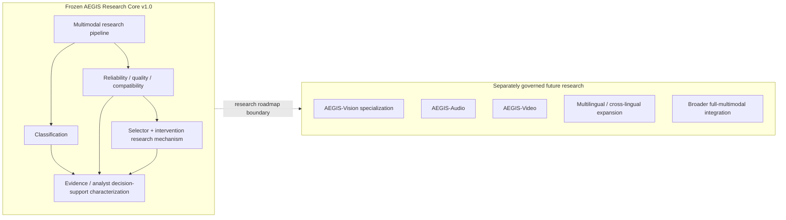

# F8 鈥?AEGIS v1.0 Scope versus Future Research

**Caption.** Separation between the immutable v1.0 Research Core and separately governed future research directions.

**Evidence basis.** P1鈥揚3 scope boundaries and the post-v1 packaging protocol.

**Interpretation boundary.** Future modules are roadmap directions only and must not be represented as completed, validated, or released v1.0 capabilities.
